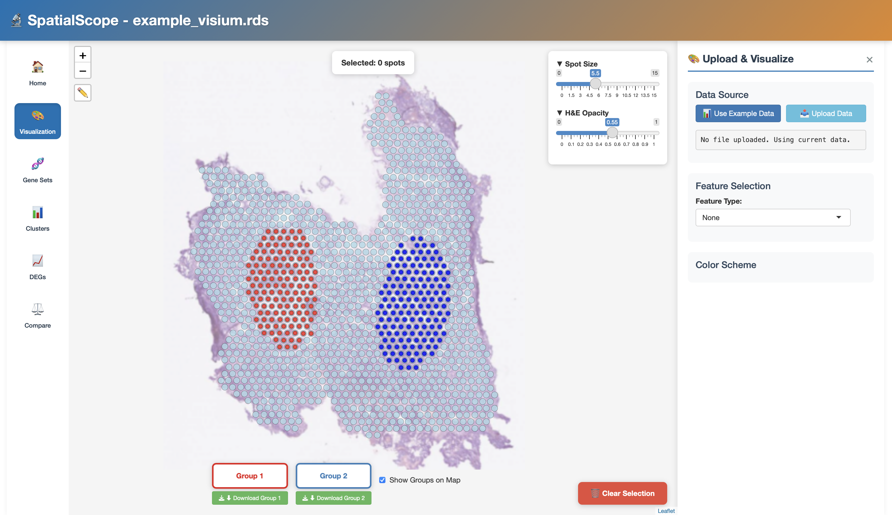
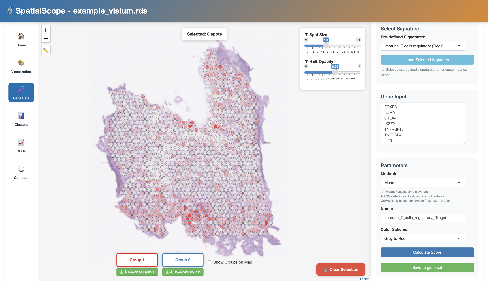
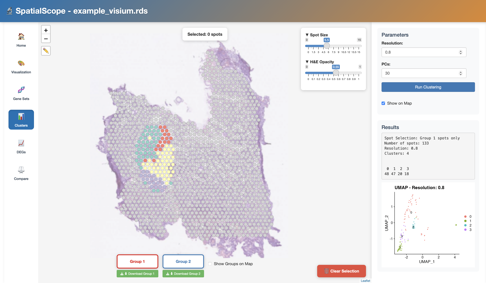
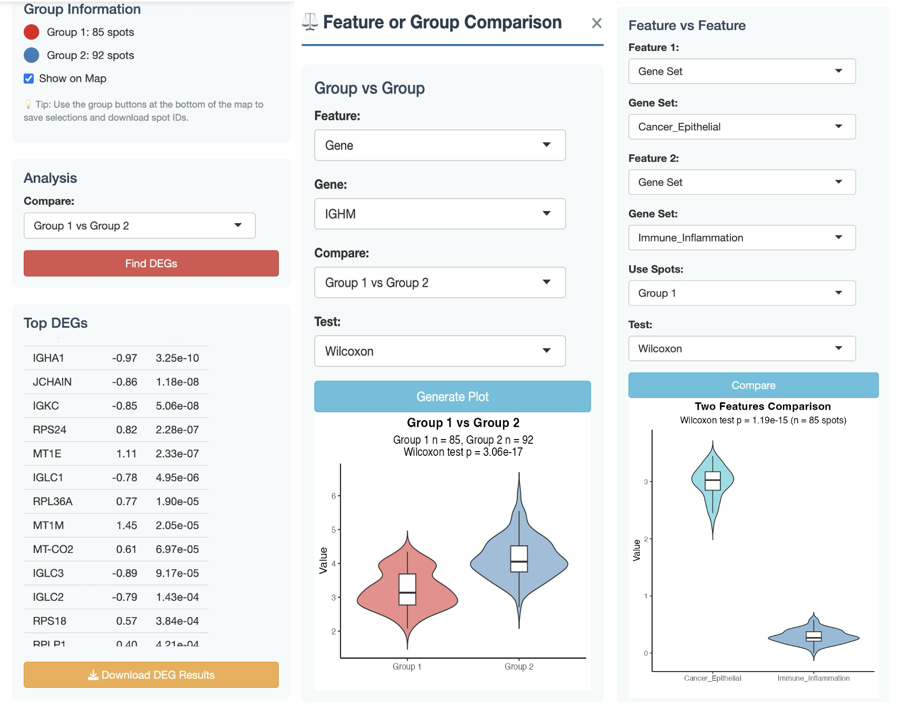

## Summary

SpatialScope is an open-source R Shiny application designed for intuitive analysis and visualization of spatial transcriptomics data. Built on processed Seurat objects, it enables users to manually define custom regions of interest (ROIs) directly on histology-aligned tissue images, overlay gene expression and metadata, and perform downstream analyses such as clustering, gene set scoring, differential expression analysis, and feature comparison within a unified interface. Analyses are accompanied by interactive visual outputs, including spatial overlays, violin plots with statistical comparisons, and exportable summary tables, all accessible without coding expertise. By empowering users to interactively select biologically meaningful regions, SpatialScope facilitates exploration of tissue-specific gene expression programs, comparison of microenvironments, and hypothesis-driven insights across diverse biological and clinical settings.

## Statement of Need

Spatially resolved transcriptomics has transformed our understanding of tissue architecture by linking gene expression to morphological context. For both pathologists and researchers, an intuitive interface that bridges H&E histology and molecular features is critical for interpreting spatial molecular patterns in tissue function and disease.

While single-cell analysis tools such as Cellxgene [@czi_cell_science_program_cz_2025] allow users to interactively explore and compare cell populations in expression space, there remains no equally user-friendly platform for exploring and analyzing spatial transcriptomics data directly on tissue images. For example, researchers and pathologists are often more interested in biologically and clinically relevant tissue boundaries such as the tumor–microenvironment interface (invasive front), where malignant cells interact with stromal or immune components [@hunter_spatially_2021]. These regions are critical for understanding cancer invasion, metastasis, and therapeutic resistance. Manually defining such irregular regions directly on histological slides and linking them to transcriptomic patterns or cell-type composition is essential for formulating and validating biological hypotheses, especially when integrating human expert annotations with downstream computational analyses.

Existing software partially addresses these needs but leaves critical gaps in interactive spatial analysis. Commercial visualization tools such as Loupe Browser and Xenium Explorer (10x Genomics) [@marco_salas_optimizing_2025] provide interfaces that link histological images with gene expression data, allowing users to visualize transcriptomic features in spatial context. However, these platforms are tightly coupled to proprietary 10x data formats and require access to raw sequencing outputs, making them unsuitable for many researchers who work primarily with public datasets or processed objects generated through Seurat/Scanpy [@satija_spatial_2015; @palla_squidpy_2022]. This constraint severely limits their flexibility for downstream exploration and cross-platform integration.

Open-source frameworks such as ST Viewer [@fernandez_navarro_st_2019], Squidpy [@palla_squidpy_2022], and TissUUmaps [@pielawski_tissuumaps_2023] offer greater accessibility but remain limited in scope. ST Viewer is a standalone application that supports only datasets generated by specific Spatial Transcriptomics technologies and is incompatible with newer platforms such as 10x Visium and Xenium. In contrast, Squidpy and TissUUmaps provide interactive visualization environments but often require substantial coding expertise and offer only limited support for complex, region-based analyses. Such limitations restrict the broader adoption by experimental biologists and pathologists.

To bridge the existing gap, we developed SpatialScope, a comprehensive and accessible platform that integrates spatial visualization with analytical flexibility while accepting direct input of Seurat objects. SpatialScope enables users to manually define and compare irregular, biologically meaningful ROIs directly on histological images. This capability is essential for exploratory and hypothesis-driven research. Within the same interface, users can perform region-specific analyses such as clustering, gene set scoring, and differential expression analysis. By integrating these functions into an interactive, web-based platform, SpatialScope enpowers researchers to derive interpretable and biologically meaningful insights from spatial transcriptomics data without the need for programming expertise.

## Main Features

SpatialScope offers an integrated suite of region-specific analysis and visualization tools for spatial transcriptomics.

### Interactive ROI Selection

SpatialScope enables users to draw and define irregularly shaped ROIs directly on tissue images, extract/export corresponding spot IDs, and label groups for downstream analysis.

### Gene Set Scoring and Visualization

The platform supports scoring of predefined or user-defined gene sets (e.g., immune, stromal, or pathway signatures) using mean expression, Seurat's AddModuleScore, or GSVA. Module scores are overlaid on the spatial tissue map and can be saved for downstream exploration.

### ROI-based Clustering

Clustering can be performed globally across all spots or locally within selected ROIs using Seurat's PCA–neighbor graph–Leiden/Louvain pipeline, helping identify localized transcriptionally distinct domains.

### Differential Expression Analysis

The tool identifies differentially expressed genes (DEGs) between selected ROIs (e.g., ROI1 vs. ROI2) or between a ROI and the rest of the tissue using Seurat's `FindMarkers`. Results include ranked p-values, log₂ fold changes, and exportable tables.

### Feature Comparison Across and Within Regions

SpatialScope enables flexible comparisons of gene expression, gene set scores, and metadata either across ROIs or among features within a single region. The outputs are visualized using  violin plots accompanied by paired statistical tests (e.g., t-test, Wilcoxon test).

## User Example

To illustrate the functionality of SpatialScope, we provide a usage walkthrough using the built-in example data.

Users can upload their own Seurat object or select the preloaded example, derived from human colorectal cancer spatial transcriptomics [@valdeolivas_profiling_2024], for quick exploration. Adjustable spot size, opacity, and zoom controls enhance visualization of gene expression and metadata on the H&E image, where users can also interactively draw irregular ROIs using the brush tool. Two such regions are defined for downstream comparison (Figure 1). The region visualization can be overlaid with a selected feature, such as gene expression or metadata, to provide an immediate visual impression of how the regions relate to underlying molecular patterns.

To assess cell-type enrichment or regional functional programs, SpatialScope provides predefined (or user-customized) gene sets curated from CellMarker 2.0 [@hu_cellmarker_2023], such as the T regulatory cell (Treg). These gene sets can be scored using methods including mean expression, GSVA and AddModuleScore. The resulting scores are overlaid on the H&E image to highlight biologically relevant regions (Figure 2).

Building on this, clustering can be performed within a selected ROI or all spots to reveal transcriptionally distinct subregions. In Figure 3, Group 1 is clustered using Seurat's PCA–neighbor–Leiden pipeline, with adjustable parameters such as resolution (set to 0.8) and number of principal components (PCs, set to 30), resulting in three clusters. Results are displayed in both UMAP and spatial views.

To investigate region-specific molecular differences, SpatialScope integrates differential expression and feature comparison tools. Using Seurat's `FindMarkers`, users can identify top DEGs between regions (e.g., Group 1 vs. Group 2 or Group 1 vs. rest) or between clusters within a region, with results reported as log₂ fold changes and ranked by p-values. Violin plots with paired tests further support comparisons of specific genes (e.g., IGHM) across ROIs or gene sets (e.g., cancer_epithelial vs. immune_inflammation) within a single region, revealing localized transcriptional patterns. Figure 4 presents both DEG results and violin plots, illustrating distinctions between ROIs and enrichment of specific features.

## Acknowledgements

This work is supported by NIH grants including NHGRI R01HG014023, NLM 4R00LM013089, 5R01LM012011, and by U.S. NIH grants R35GM158094 and R01GM134020, as well as NSF grants DBI-2238093, DBI-2422619, IIS-2211597, and MCB-2205148. We also gratefully acknowledge the support and computational resources provided by the University of Pittsburgh Center for Research Computing and Data (CRCD), which enabled hosting the development of the SpatialScope application.

## References
