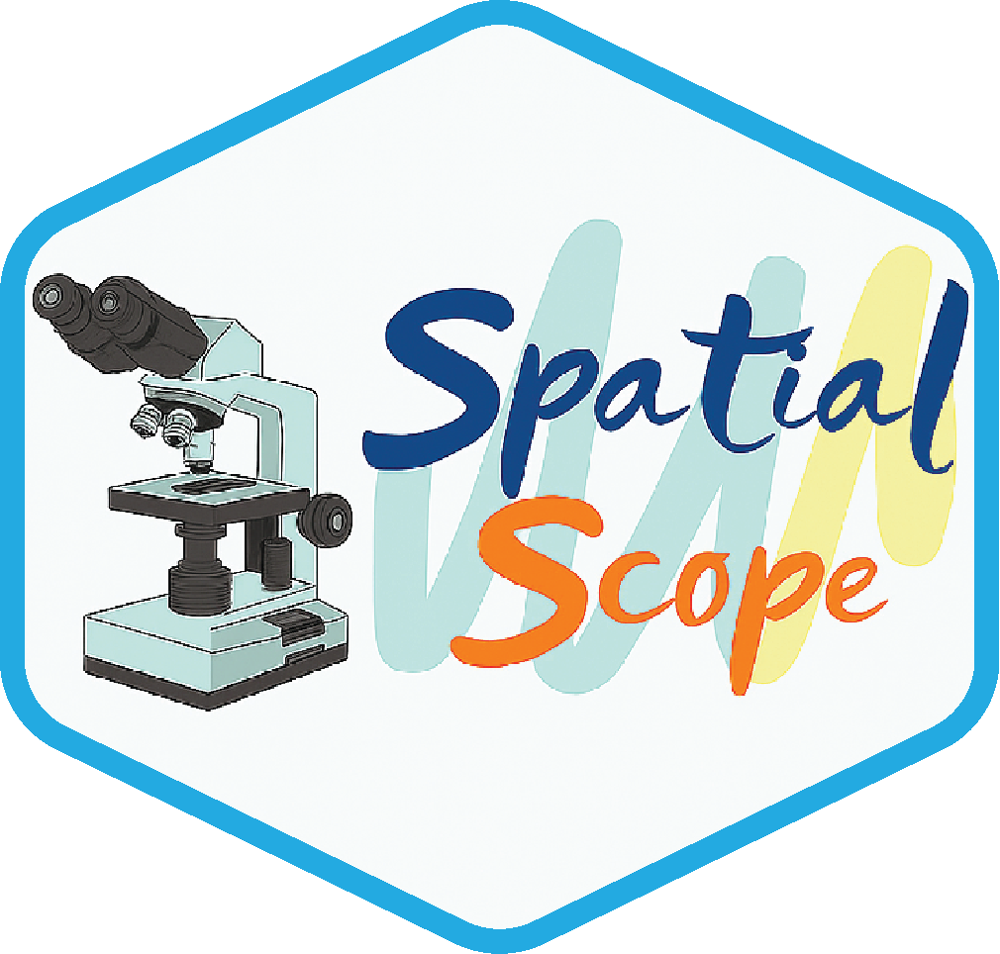

# SpatialScope 

SpatialScope is designed to facilitate the ROI-specific exploration, visualization, and analysis of spatial transcriptomics data.

**SpatialScope** is an interactive R package with a browser-based interface that enables spatial visualization and analysis directly from processed Seurat objects. Users can interactively select regions of interest (ROI), visualize gene expression patterns, and perform downstream analyses such as cell-type signature scoring, clustering, and differential expression analysis.

SpatialScope can be accessed via a public demo hosted by the University of Pittsburgh: [https://shiny.crc.pitt.edu/spatial_api/](https://shiny.crc.pitt.edu/spatial_api/).

**Note:** This instance is intended for demonstration purposes only and does not support concurrent user uploads or large-scale use.

---

## Installation

If you haven’t installed the required Bioconductor packages (Seurat, GSVA), run the following first:

```r
if (!requireNamespace("BiocManager", quietly = TRUE)) {
  install.packages("BiocManager")
}
BiocManager::install(c("Seurat", "GSVA"))
```

You can then install SpatialScope directly from GitHub:

```r
# install.packages("devtools")
devtools::install_github("myaol/SpatialScope")
```

---

## Launching the App

### With Example Data

```r
library(SpatialScope)
run_SpatialScope("demo")
```

### With Your Own Data

```r
library(SpatialScope)
my_data <- readRDS("path/to/your_seurat.rds")
run_spatial_selector(my_data, sample_name = "MyExperiment", show_image = TRUE)
```

Or upload through the app interface in the Visualization section using the 📤 **Upload Data** panel.

**Requirements:** Seurat object with spatial coordinates, raw or normalized expression data, and H&E image.

---

## ROI Selection Tool

### Quick Spot Selection with `draw_ROI()`

If you only need to select spots from a region of interest without launching the full analysis app:

```r
library(SpatialScope)

# Load your Seurat object
my_data <- readRDS("path/to/your_seurat.rds")

# Launch interactive ROI selector
selected_spots <- draw_ROI(my_data, sample_name = "MyExperiment")

# The function returns a vector of spot IDs
print(selected_spots)
length(selected_spots)

# Use the selected spots for downstream analysis
subset_data <- subset(my_data, cells = selected_spots)
```

This function supports multiple ROI selections and returns a vector of spot IDs, ideal for custom downstream workflows.

---

## Features

- 🗺️ **Interactive Map** - Freehand drawing tools to select custom regions of interest
- 🎨 **Gene Visualization** - Display gene expression and metadata patterns spatially
- 🧬 **Gene Set Analysis** - Calculate multi-gene signatures using pre-defined libraries or custom lists for human and mouse
- 📊 **Spatial Clustering** - Identify spatial domains using graph-based clustering methods
- 📈 **DEG Analysis** - Find differentially expressed genes between selected groups or clusters
- ⚖️ **Feature Comparison** - Statistical comparison plots with parametric/non-parametric tests
- 💾 **Data Export** - Download spot IDs, DEG results, and Seurat subsets

---

## Documentation

📚 **Detailed tutorials and examples:**
- [User Guide Vignette](vignettes.Rmd) - Step-by-step walkthrough
- [JOSS Paper](JOSS/paper.md) - Comprehensive methodology and features

📹 **Video Tutorial:** A video tutorial will be available soon.[YouTube Quickstart](https://youtu.be/**)

---

## Getting Help

If you encounter bugs or have suggestions for improvements:
- **Report issues:** [GitHub Issues](https://github.com/myaol/SpatialScope/issues)
- **Contact authors:**
  - Aodong Qiu: [qiuaodon@pitt.edu](mailto:qiuaodon@pitt.edu)
  - Mengyao Lu: [mel373@pitt.edu](mailto:mel373@pitt.edu)
  - Lujia Chen: [luc17@pitt.edu](mailto:luc17@pitt.edu)

When reporting issues, please include your sessionInfo(), a minimal reproducible example, and any error messages.

---

## Citation

If you use SpatialScope in your research, please cite:

```bibtex
@article{SpatialScope2025,
  title = {SpatialScope: An Interactive R Shiny Package for Manual Region-Based Analysis of Spatial Transcriptomics Data},
  author = {Qiu, Aodong and Lu, Mengyao and Lu, Xinghua and Xu, Min and Chen, Lujia},
  journal = {Journal of Open Source Software},
  year = {2025},
  volume = {X},
  number = {X},
  pages = {XXXX},
  doi = {XXXXX},
  url = {https://github.com/mayol/SpatialScope}
}
```


---

## Disclaimer

SpatialScope is designed to facilitate intuitive visualization, region selection, and exploratory analysis of spatial transcriptomics data. The tool provides convenient interfaces for clustering, differential expression, and feature comparison, but these analyses are intended for exploratory purposes only. Users should validate any biological interpretations using appropriate statistical or experimental methods.

---

## Acknowledgments

This work is supported by NIH grants including NHGRI R01HG014023, NLM 4R00LM013089, 5R01LM012011, and by U.S. NIH grants R35GM158094 and R01GM134020, as well as NSF grants DBI-2238093, DBI-2422619, IIS-2211597, and MCB-2205148. We also gratefully acknowledge the support and computational resources provided by the University of Pittsburgh Center for Research Computing and Data (CRCD), which enabled hosting the development of the SpatialScope application.

---

## License

This project is licensed under the MIT License - see the [LICENSE](LICENSE) file for details.
